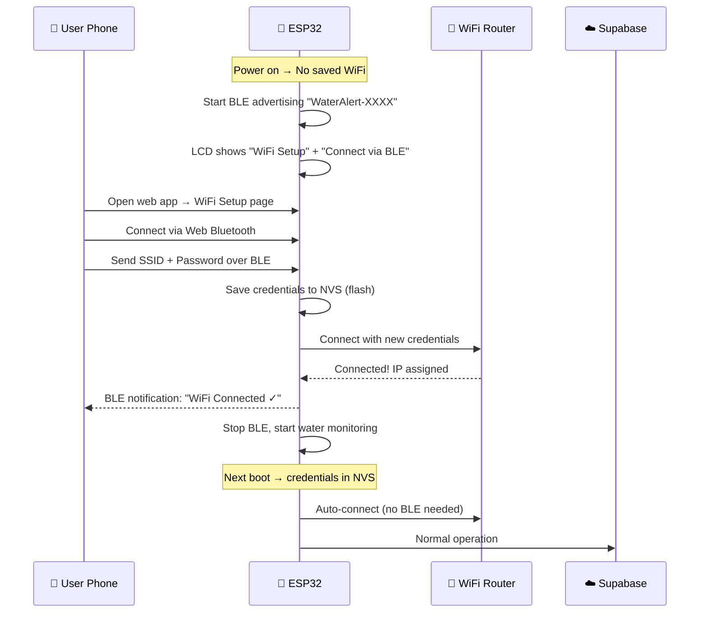
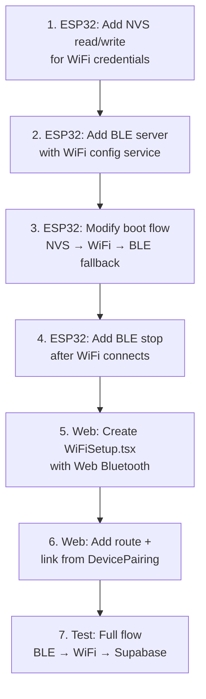

# BLE WiFi Provisioning for ESP32 Water Alert

Remove hardcoded WiFi credentials from the ESP32 firmware. Instead, users will configure WiFi over Bluetooth (BLE) from their phone/browser.

## How It Works (User Flow)



## User Review Required

> [!IMPORTANT]
> **Web Bluetooth API** only works in Chrome/Edge/Opera on Android and desktop. It does NOT work in Safari/iOS. For iPhone users, we have two alternatives:
> - **Option A**: Use the Espressif BLE Provisioning app (free, iOS + Android)
> - **Option B**: Build a fallback "AP mode" where ESP32 creates its own WiFi hotspot and serves a config page
>
> **Recommendation**: Implement Web Bluetooth (works for your Android phone) + AP mode fallback (works everywhere).

> [!WARNING]
> Adding BLE increases ESP32 flash usage by ~200KB. Your current 4MB flash has plenty of room, but BLE + WiFi running simultaneously uses ~80KB more RAM. The ESP32 has 320KB — this is fine but we should disable BLE after WiFi connects to free memory.

## Open Questions

1. **Do you want AP mode fallback?** (ESP32 creates its own WiFi hotspot `WaterAlert-Setup` for configuration when BLE isn't available)
2. **Should the "WiFi Setup" be a separate page in the web app or integrated into the existing Device Pairing page?**
3. **Do you want a "Reset WiFi" button on the ESP32 hardware?** (e.g., hold a button for 5s to clear saved WiFi and restart BLE provisioning)

---

## Proposed Changes

### ESP32 Firmware

#### [MODIFY] [water_alert_system.ino](file:///c:/Users/hafiz/OneDrive/Desktop/water%20alert/water_alert_system/water_alert_system.ino)

**Summary**: Replace hardcoded WiFi with BLE provisioning + NVS storage.

**New includes**:
```cpp
#include <BLEDevice.h>
#include <BLEServer.h>
#include <BLEUtils.h>
#include <BLE2902.h>
#include <Preferences.h>    // NVS (non-volatile storage)
```

**New BLE service**:
| Item | Value |
|---|---|
| Service UUID | `12345678-1234-1234-1234-123456789abc` |
| SSID Characteristic | `12345678-1234-1234-1234-123456789abd` (Write) |
| Password Characteristic | `12345678-1234-1234-1234-123456789abe` (Write) |
| Status Characteristic | `12345678-1234-1234-1234-123456789abf` (Read + Notify) |
| Command Characteristic | `12345678-1234-1234-1234-123456789ac0` (Write — for "connect now" trigger) |

**Boot flow changes**:
```
setup() {
  1. Init LCD, Serial
  2. Read NVS → check for saved SSID
  3. IF saved SSID exists:
       → Try WiFi.begin(savedSSID, savedPass)
       → If success: skip BLE, proceed normally
       → If fail after 15s: start BLE provisioning
  4. IF no saved SSID:
       → Start BLE advertising
       → LCD: "WiFi Setup" / "BLE: WaterAlert-XXXX"
       → Wait for credentials via BLE
  5. Once WiFi connected:
       → Stop BLE (free RAM)
       → Sync NTP
       → Start water monitoring
}
```

**Key code changes**:

| Section | Change |
|---|---|
| Lines 65-69 | Remove `#define WIFI_SSID` and `#define WIFI_PASSWORD` |
| Lines 333-372 | Replace `connectWiFi()` with `connectWiFiFromNVS()` — reads credentials from flash |
| New function | `startBLEProvisioning()` — creates BLE server with WiFi config service |
| New function | `stopBLE()` — shuts down BLE stack after WiFi connects (frees ~80KB RAM) |
| New callback class | `WiFiConfigCallbacks` — handles BLE write events for SSID/password |
| New function | `saveWiFiCredentials(ssid, pass)` — writes to NVS |
| New function | `clearWiFiCredentials()` — erases NVS (for reset button) |

**NVS storage layout**:
```
Namespace: "wifi_cfg"
  Key: "ssid"     → String (max 32 chars)
  Key: "password"  → String (max 64 chars)
```

---

### Web App — New WiFi Setup Page

#### [NEW] [WiFiSetup.tsx](file:///c:/Users/hafiz/OneDrive/Desktop/water/water-alert/src/pages/WiFiSetup.tsx)

A new page accessible from the Device Pairing flow that uses the **Web Bluetooth API** to:
1. Scan for nearby `WaterAlert-XXXX` devices
2. Connect via BLE
3. Show a form for SSID + Password
4. Send credentials to the ESP32
5. Show real-time connection status via BLE notifications

**UI flow**:
```
┌──────────────────────────────┐
│  📶 Configure ESP32 WiFi     │
│                              │
│  [🔍 Scan for Device]        │  ← Web Bluetooth scan
│                              │
│  Found: WaterAlert-8B9C      │
│  Status: 🔵 Connected        │
│                              │
│  ┌────────────────────────┐  │
│  │ WiFi Network (SSID)    │  │
│  │ [Fiber-MX-4G        ]  │  │
│  │                        │  │
│  │ Password              │  │
│  │ [••••••••••          ]  │  │
│  │                        │  │
│  │ [💾 Send to ESP32]     │  │
│  └────────────────────────┘  │
│                              │
│  Status: ✅ WiFi Connected!  │
│  IP: 192.168.1.105           │
│                              │
│  [→ Continue to Pair Device] │
└──────────────────────────────┘
```

**Web Bluetooth code pattern**:
```typescript
// Scan for ESP32
const device = await navigator.bluetooth.requestDevice({
  filters: [{ namePrefix: 'WaterAlert' }],
  optionalServices: ['12345678-1234-1234-1234-123456789abc']
});

// Connect
const server = await device.gatt.connect();
const service = await server.getPrimaryService('12345678-1234-1234-1234-123456789abc');

// Write SSID
const ssidChar = await service.getCharacteristic('12345678-...-abd');
await ssidChar.writeValue(new TextEncoder().encode(ssid));

// Write Password
const passChar = await service.getCharacteristic('12345678-...-abe');
await passChar.writeValue(new TextEncoder().encode(password));

// Send "connect" command
const cmdChar = await service.getCharacteristic('12345678-...-ac0');
await cmdChar.writeValue(new Uint8Array([0x01]));

// Listen for status notifications
const statusChar = await service.getCharacteristic('12345678-...-abf');
await statusChar.startNotifications();
statusChar.addEventListener('characteristicvaluechanged', (e) => {
  const status = new TextDecoder().decode(e.target.value);
  // status = "CONNECTING" | "CONNECTED:192.168.1.105" | "FAILED:wrong_password"
});
```

---

#### [MODIFY] [DevicePairing.tsx](file:///c:/Users/hafiz/OneDrive/Desktop/water/water-alert/src/pages/DevicePairing.tsx)

Add a "Configure WiFi" button/link that navigates to `/wifi-setup` before the QR scanner section. Show it when the device is in BLE provisioning mode.

---

#### [MODIFY] [App.tsx or router config]

Add route: `/wifi-setup` → `<WiFiSetup />`

---

## Implementation Order



## Verification Plan

### Manual Verification
1. **Fresh boot (no NVS)**: ESP32 should show "WiFi Setup / BLE: WaterAlert-XXXX" on LCD
2. **Web app scan**: Should find and connect to ESP32 via BLE
3. **Send credentials**: ESP32 connects to WiFi, LCD shows "WiFi Connected"
4. **Reboot**: ESP32 auto-connects from NVS without BLE
5. **Wrong password**: ESP32 reports "FAILED" via BLE notification, stays in BLE mode
6. **Water detection**: Full pipeline still works after BLE provisioning (sensor → Supabase → Telegram)

### Automated Tests
- `npm run build` — verify web app compiles with new WiFiSetup page
- Arduino IDE compile — verify ESP32 sketch compiles with BLE libraries
